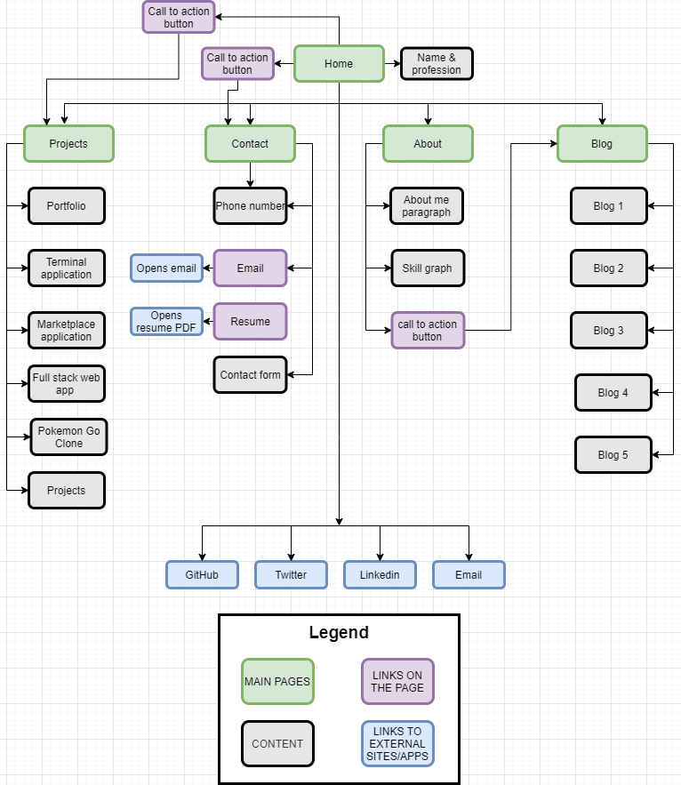
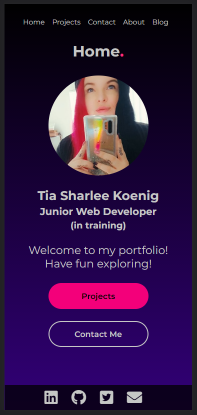

# TiaKoenig_T1A2

# **Website Link**

[link to live site] (https://vigilant-agnesi-564de4.netlify.app/)

# **Github Repo**

[link to Github Repository] (https://github.com/Tia-Koenig/TiaKoenig_T1A2)

# **Purpose**

The purpose of my portfolio website is to source potential new clients as well as expand my network and promote my technical skills.

# **Target Audience**

My target audience is future employers/clients.

# **Functionality/Features**

My Portfolio includes 5 pages, Home, Projects, Contact, About and Blog. Each page has a navigation bar located at the top of the page to allow ease of navigation while browsing, also call to action buttons on the Home page and About page to steer users to important pages like Contact, Projects & Blog. Home page features a picture of me,my name, profession and a short welcoming encouraging users to see my projects and to contact me. Contact page has my contact information, resume and a contact form. About page has a short description of my favorite things and also mentions my previous study in Art, also included is a graph of my skills and a call to action button to direct users to find out more about me on my blog page. Blog page includes future blog posts that will be written by me.

# **Sitemap**

# **Home Page Screenshots**

## Home page mobile screenshots

## Home page tablet screenshot

## Home page desktop screenshot

# **Projects Page Screenshots**

## Projects page mobile screenshots

## Projects page tablet screenshots

## Projects page desktop screenshots

# **Contact Page Screenshots**

## Contact page mobile screenshots

## Contact page tablet screenshots

## Contact page desktop screenshots

# **About Page Screenshots**

## About page mobile screenshots

## About page tablet screenshots

## About page desktop screenshots

# **Blog Page Screenshots**

## Blog page mobile screenshots

## Blog page tablet screenshots

## Blog page desktop screenshots

# **Technical Stack**

- HTML -used for site markup 
- CSS - used for site styling
- GIT - used for local and remote source control
- GITHUB - used to create a remote repository
- Balsamiq - used for wireframes
- NETLIFY - used to deploy live site